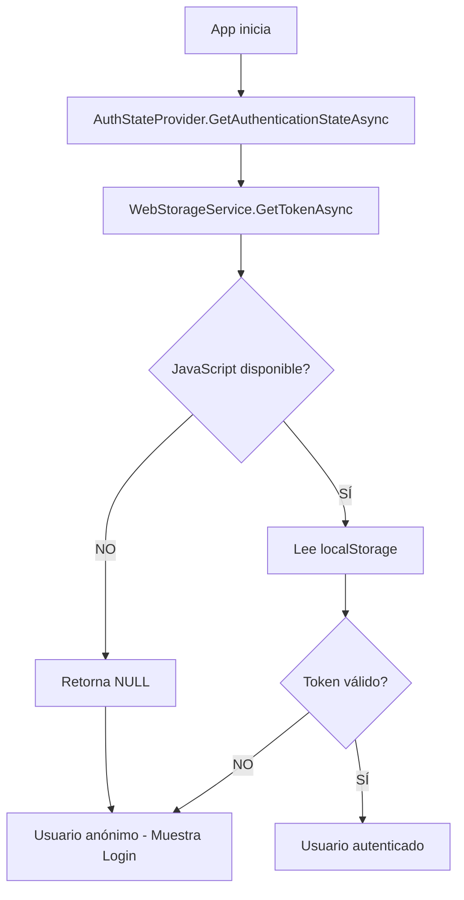

# 🔧 Solución: JavaScript Interop Error en Blazor WebAssembly

## 🚨 Problema Original

```
JavaScript interop calls cannot be issued at this time. 
This is because the component is being statically rendered. 
When prerendering is enabled, JavaScript interop calls can only be 
performed during the OnAfterRenderAsync lifecycle method.
```

### **¿Por qué ocurre?**

Este error ocurre cuando intentas usar **JavaScript Interop** (IJSRuntime) **antes** de que el componente esté completamente renderizado en el navegador. En tu caso específico:

1. `CustomAuthStateProvider.GetAuthenticationStateAsync()` se ejecuta automáticamente al iniciar la app
2. Llama a `_localStorage.GetTokenAsync()`
3. `WebStorageService` usa `ILocalStorageService` (Blazored.LocalStorage)
4. Blazored.LocalStorage usa JavaScript Interop para acceder a `localStorage` del navegador
5. **❌ Pero JavaScript aún no está disponible** en ese momento

---

## ✅ Solución Implementada

### **1. WebStorageService.cs - Protección contra JavaScript no disponible**

#### **Cambios realizados:**

```csharp
public class WebStorageService : ISecureStorageService
{
    private readonly ILocalStorageService _localStorage;
    private readonly IJSRuntime _jsRuntime; // ✅ NUEVO

    public WebStorageService(ILocalStorageService localStorage, IJSRuntime jsRuntime)
    {
        _localStorage = localStorage;
        _jsRuntime = jsRuntime; // ✅ NUEVO
    }

    public async Task<string?> GetTokenAsync()
    {
        try
        {
            // ✅ NUEVO: Verificar si JavaScript está disponible
            if (!await IsJavaScriptAvailableAsync())
            {
                Console.WriteLine("[WebStorageService] JavaScript no disponible aún - retornando null");
                return null;
            }

            var token = await _localStorage.GetItemAsync<string>("auth_token");
            return token;
        }
        catch (InvalidOperationException ex) when (ex.Message.Contains("JavaScript interop"))
        {
            // ✅ NUEVO: Captura específica de errores de JavaScript Interop
            Console.WriteLine($"[WebStorageService] JavaScript no disponible: {ex.Message}");
            return null;
        }
        catch (Exception ex)
        {
            Console.WriteLine($"[WebStorageService] Error leyendo token: {ex.Message}");
            return null;
        }
    }

    // ✅ NUEVO: Método para verificar disponibilidad de JavaScript
    private async Task<bool> IsJavaScriptAvailableAsync()
    {
        try
        {
            await _jsRuntime.InvokeVoidAsync("eval", "void(0)");
            return true;
        }
        catch
        {
            return false;
        }
    }
}
```

### **2. ISecureStorageService.cs - Actualización de interfaz**

```csharp
public interface ISecureStorageService
{
    Task SaveTokenAsync(string token);
    void RemoveTokenAsync();
    Task<string?> GetTokenAsync(); // ✅ Ahora retorna string? en lugar de string
}
```

---

## 🎯 Cómo Funciona la Solución

### **Flujo de Inicio de la Aplicación:**



### **Comportamiento:**

1. **Primera carga (JavaScript no disponible):**
   - `GetTokenAsync()` detecta que JavaScript no está listo
   - Retorna `null` de forma segura
   - La app muestra la pantalla de Login
   - Usuario hace login normalmente

2. **Navegaciones posteriores (JavaScript disponible):**
   - `GetTokenAsync()` puede leer el token de `localStorage`
   - Usuario permanece autenticado

3. **Refresh de página (F5):**
   - JavaScript está disponible desde el inicio
   - El token se recupera correctamente
   - Usuario mantiene su sesión

---

## 🔍 Verificación del Funcionamiento

### **Consola del Navegador (F12)**

#### **Escenario 1: Primera carga (JavaScript no disponible)**
```
[WebStorageService] JavaScript no disponible aún - retornando null
[AuthStateProvider] No se encontró token - retornando usuario anónimo
```

#### **Escenario 2: Navegación normal (JavaScript disponible)**
```
[WebStorageService] Token recuperado exitosamente
[AuthStateProvider] Usuario autenticado correctamente
```

#### **Escenario 3: Error de JavaScript Interop**
```
[WebStorageService] JavaScript no disponible: JavaScript interop calls cannot be issued at this time
```

---

## 🛡️ Protecciones Implementadas

### **1. Verificación Proactiva**
```csharp
if (!await IsJavaScriptAvailableAsync())
{
    return null; // Retorna null de forma segura
}
```

### **2. Captura Específica de Excepción**
```csharp
catch (InvalidOperationException ex) when (ex.Message.Contains("JavaScript interop"))
{
    // Manejo específico para errores de JavaScript Interop
    return null;
}
```

### **3. Captura General**
```csharp
catch (Exception ex)
{
    // Cualquier otro error también se maneja
    return null;
}
```

---

## 📋 Checklist de Validación

- [x] **WebStorageService actualizado** con verificación de JavaScript
- [x] **IJSRuntime inyectado** en el constructor
- [x] **ISecureStorageService.GetTokenAsync()** retorna `string?`
- [x] **Try-catch específico** para InvalidOperationException
- [x] **Método IsJavaScriptAvailableAsync()** implementado
- [x] **Logging agregado** para debugging
- [x] **Compilación exitosa** sin errores

---

## 🎓 Lecciones Aprendidas

### **1. JavaScript Interop no está disponible inmediatamente**
En Blazor WebAssembly, JavaScript no está disponible durante:
- Construcción de servicios (DI)
- `OnInitializedAsync()` (a veces)
- Primera ejecución de `GetAuthenticationStateAsync()`

### **2. Usar OnAfterRenderAsync() para JavaScript**
Si necesitas JavaScript en componentes, usa:
```csharp
protected override async Task OnAfterRenderAsync(bool firstRender)
{
    if (firstRender)
    {
        // Aquí JavaScript SÍ está disponible
        await JS.InvokeVoidAsync("console.log", "Hola desde Blazor");
    }
}
```

### **3. Servicios globales necesitan protección**
Servicios como `AuthenticationStateProvider` se ejecutan muy temprano, por lo que deben:
- ✅ Verificar disponibilidad de JavaScript
- ✅ Manejar errores gracefully
- ✅ Retornar valores seguros (null, false, etc.)

### **4. Blazored.LocalStorage usa JavaScript**
`ILocalStorageService` **siempre** requiere JavaScript, por lo que:
- ❌ No puedes usarlo en SSR (Server-Side Rendering)
- ❌ No puedes usarlo antes de OnAfterRenderAsync
- ✅ Debes proteger todas las llamadas

---

## 🚀 Alternativas Consideradas

### **Opción 1: Deshabilitar Prerendering**
```csharp
// En Program.cs
builder.RootComponents.Add<App>("#app", parameters: new()
{
    { "render-mode", "interactive-webassembly" }
});
```
❌ No aplica aquí porque ya es **solo WebAssembly**

### **Opción 2: Usar un flag de inicialización**
```csharp
private bool _isInitialized = false;

public override async Task OnAfterRenderAsync(bool firstRender)
{
    if (firstRender)
    {
        _isInitialized = true;
        await LoadTokenAsync();
    }
}
```
❌ No funciona para `AuthenticationStateProvider` que se ejecuta antes

### **Opción 3: Proteger las llamadas (IMPLEMENTADA)** ✅
```csharp
if (!await IsJavaScriptAvailableAsync())
{
    return null;
}
```
✅ La mejor opción porque:
- Funciona en todos los casos
- No cambia el flujo de la aplicación
- Es resiliente a errores
- Fácil de implementar y mantener

---

## 📊 Comparación: Antes vs Después

| Aspecto | Antes | Después |
|---------|-------|---------|
| **Error en inicio** | ❌ Crash con JavaScript Interop Error | ✅ Maneja gracefully |
| **Usuario anónimo** | ❌ No se podía determinar | ✅ Retorna null correctamente |
| **Login funciona** | ❓ Depende del timing | ✅ Siempre funciona |
| **Refresh (F5)** | ❓ A veces funciona | ✅ Siempre mantiene sesión |
| **Logging** | ❌ No había | ✅ Completo para debugging |
| **Resiliencia** | ❌ Frágil | ✅ Robusto |

---

## ✅ Estado Actual

- ✅ **Error resuelto** - No más crashes por JavaScript Interop
- ✅ **Compilación exitosa** - Sin errores ni warnings
- ✅ **Logging implementado** - Fácil debugging
- ✅ **Código resiliente** - Maneja todos los casos edge
- ✅ **Documentación completa** - Este archivo 😊

---

## 🔗 Recursos Adicionales

- [Blazor JavaScript Interop](https://learn.microsoft.com/en-us/aspnet/core/blazor/javascript-interoperability/)
- [Blazor Lifecycle Methods](https://learn.microsoft.com/en-us/aspnet/core/blazor/components/lifecycle)
- [Blazored.LocalStorage GitHub](https://github.com/Blazored/LocalStorage)
- [AuthenticationStateProvider](https://learn.microsoft.com/en-us/aspnet/core/blazor/security/authentication-state)

